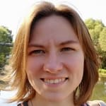
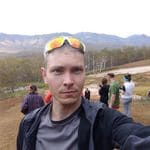

# 🏞️ Поход 2кс по Западному Кавказу в районе горы Дженту

## Содержание

- [Команда](#команда)
- [Даты](#даты)
- [Маршрут](#маршрут)
- [Отчет](#отчет)
- [Логистика](#логистика)
- [Курирование](#курирование)
- [Восход солнца](#восход-солнца)
- [Личное снаряжение](#личное-снаряжение)
- [Общественное снаряжение](#общественное-снаряжение)
- [Раскладка](#раскладка)
- [Аптечка](#аптечка)
- [Ремнабор](#ремнабор)
- [Финансы](#финансы)
- [Контрольный выход](#контрольный-выход)
- [Другое](#другое)
- [Ссылки](#ссылки)

## Команда

<table>
  <tr>
    <td align="center">
      <a href="https://vk.com/fenestron">
        
         <b>Кулагин Александр</b>
      </a> Руководитель
    </td>
    <td align="center">
      <a href="https://vk.com/id50908541">
        
         <b>Кравченко Мария</b>
      </a> Завпит
    </td>
    <td align="center">
      <a href="https://vk.com/tau171">
        
         <b>Ломаев Дмитрий</b>
      </a> Завснар, краевед
    </td>
    <td align="center">
      <a href="https://vk.com/mlazorevaya">
        
         <b>Толкачева Марина</b>
      </a> Медик
    </td>
  </tr>
  <tr>
    <td align="center">
      <a href="https://vk.com/fairy_yaga">
        
         <b>Стрючкова Елизавета</b>
      </a> Фотограф
    </td>
    <td align="center">
      <a href="https://vk.com/bomkvilt">
        
         <b>Лебедев Илья</b>
      </a> Реммастер, логист, связист
    </td>
    <td align="center">
      <a href="https://vk.com/dobrody">
        
         <b>Добродий Диана</b>
      </a> Видеооператор
    </td>
    <td align="center">
      <a href="https://vk.com/bonjour_toujours">
        
         <b>Иващенко Арина</b>
      </a> Эколог
    </td>
  </tr>
</table>

## Даты

Отъезд из Москвы: 31 июля

Выход на маршрут: 2 августа

Завершение маршрута: 12 августа

## Маршрут 

село Курджиново – бр. р. Бескес (1А) – р. балка Грушовая – г. Мал. Пцицер – г. Нижний Джент – р. Дженту – в. Дженту – хр. Дженту – обрыв Добрынина – спелеоприют Дорбункол – р. Правый Рожкао – р. Бол. Блыб – оз. Леушино – в. 3015 – хр. Магишо – пер. О.Т. Миршавко (1А) – оз. Скотта – г. Маркопидж – р. Хацавита – турприют Хацавита – поляна Медвежья – в. Мишин Бугор – р. Кызыл-Бек – село Солёное

[Полный трек Nakarte](https://nakarte.me/#m=11/43.89905/40.90347&l=O&nktl=jfg_SjjwKTr81TE-1KCTYQ)

## Отчет

- [**Отчет** (PDF)](https://vk.com/doc30773702_581234355?hash=8a5f6f25305f34afee&dl=a4291a1bc8dc897316)

- [**Фотоотчет** (альбом в VK)](https://vk.com/album-3102426_276565515)

- [**Походное Видео** (Youtube)](https://youtu.be/_lCEfu6mGO0)

- [**Пост о походе** (в группе турклуба ВШЭ)](https://vk.com/tkhse?w=wall-3102426_6313)

## Логистика

Поезд Москва — Армавир

| №    | Путь следования  | Вокзал         | Отправление   | Прибытие        |
|------|------------------|----------------|---------------|-----------------|
| 049А | СПБ — Кисловодск | Курский вокзал | 31 июля 22:11 | 2 августа 04:33 |

Стоимость билета: 3493р.

Из Армавира нас забрал Михаил на своей газельке. В восьмером в ней было удобно. Заброска обошлась в 5000р (до Курджиново). Из села Соленое нас забрал Михаил и привез обратно в Армавир (так же 5000р). Михаил очень пунктуальный, приезжает заранее. Рекомендую.

Номер Михаила: +7 (928)409-55-12

После похода затусили в Армавире. Погуляли по городу, покушали арбуз. После отдыха в городе половина группы поехала путешествовать автостопом по Краснодарскому краю.

## Курирование

Поход курировал Максим Колоколов. Новости публиковались в [обсуждениях группе турклуба ВШЭ](https://vk.com/topic-3102426_40573189)

Т.к. на протяжении большей части маршрута связь отсутствовала, новостей было очень мало. Мы это предвидели и заранее попросили не паниковать. Договорились, что контрольный срок выхода на связь - 12 августа.

Также группа была [зарегистрирована](https://forms.mchs.gov.ru/registration_tourist_groups) в ГУ МЧС России по Карачаево-Черкесской Республике. 

Помимо этого мы должны были сообщить о начале и завершении маршрута SMS-сообщением ответственному в МКК.

А еще на большей части маршрута нас бдили ягеря и пастухи.

## Восход солнца

Восход солнца в Курджиново по данным [world-weather](https://world-weather.ru/pogoda/russia/kurdzhinovo/sunrise/)

| Дата            | Восход | Закат | Световой день |
|-----------------|--------|-------|---------------|
| 01 августа 2020 | 05:05  | 19:39 | 14 ч. 34 мин. |
| 02 августа 2020 | 05:06  | 19:38 | 14 ч. 32 мин. |
| 03 августа 2020 | 05:07  | 19:37 | 14 ч. 30 мин. |
| 04 августа 2020 | 05:08  | 19:35 | 14 ч. 27 мин. |
| 05 августа 2020 | 05:09  | 19:34 | 14 ч. 25 мин. |
| 06 августа 2020 | 05:10  | 19:33 | 14 ч. 23 мин. |
| 07 августа 2020 | 05:11  | 19:31 | 14 ч. 20 мин. |
| 08 августа 2020 | 05:13  | 19:30 | 14 ч. 17 мин. |
| 09 августа 2020 | 05:14  | 19:28 | 14 ч. 14 мин. |
| 10 августа 2020 | 05:15  | 19:27 | 14 ч. 12 мин. |
| 11 августа 2020 | 05:16  | 19:26 | 14 ч. 10 мин. |
| 12 августа 2020 | 05:17  | 19:24 | 14 ч. 07 мин. |
| 13 августа 2020 | 05:18  | 19:23 | 14 ч. 05 мин. |
| 14 августа 2020 | 05:19  | 19:21 | 14 ч. 02 мин. |

Подъем: 05:00

Отход ко сну: 20:00 - 21:00

## Личное снаряжение

| Личное снаряжение                      |                           |
|----------------------------------------|---------------------------|
| Рюкзак+накидка                         | Пенка                     |
| Сидушка(пенопопа)                      | Спальник                  |
| Аптечка личная                         | КЛМН                      |
| Солнцезащитные очки                    | Головной убор от солнца   |
| Обувь ходовая/бивачная                 | Носки ходовые/бивачные    |
| Флиска                                 | Футболка ходовая/бивачная |
| Штаны ходовые/бивачные                 | Куртка-дождевик           |
| Плавки/купальник                       | Термобельё                |
| Перчатки рабочие с резиновым покрытием | Треккинговые палки        |
| Зажигалка/спички                       | Налобный фонарь           |
| Пластиковая бутылка 2л                 | Гигиенические средства    |
| Небольшой рюкзачок для радиалок        | Шапка/бафф                |

## Общественное снаряжение

| Предмет                      | Вес, г         | Комментарий                      |
|------------------------------|----------------|----------------------------------|
| Палатка                      | 3 760          | 4х мест                          |
| Палатка                      | 3 920          | 4х мест                          |
| Тент групповой               | 1 000          | 3x4 минимум                      |
| Котел / кан                  | 640            | 6 литров                         |
| Котел / кан                  | 500            | 4 литров                         |
| Хознабор                     | 380            | В мешке: нож, доска, 2 половника |
| Пила-ножовка                 | 190            | Пригодилась всего пару раз       |
| Ремнабор                     | 500            |                                  |
| Аптечка                      | 1 700          | Общественная + экстренная        |
| Горелка                      | 594            | Для доваривания                  |
| Горелка                      | 500            | MSR Reactor 1,7л                 |
| Баллон газовый               | 900            | 336г, 2шт, весит 450гр           |
| Баллон газовый               | 2656           | 450г, 4шт, весит 664гр           |
| Репшнур                      | 100            | 5шт                              |
| Фотоаппарат и принадлежности | 1 100          |                                  |
| Крем от загара               | 320            | 2шт                              |
| мыло/зубная паста            | 150            | Зубная паста осталась дома(      |
| Флаг                         | 233            |                                  |
| Подзорная труба / бинокль    | 663            |                                  |
| Видеокамера                  | 1 300          |                                  |
| Power bank                   | 671            | 30k                              |
|                              | Итого 21`777 г |                                  |

## Раскладка

Трехразовое питание (500г/чел/день + карпит)

Завтрак: каша с сухофруктами

Обед: Сублимированный суп

Ужин: Крупа + сублимированное мясо

На каждый обед размолотый каркаде

Каждый день на переходы шипучие витаминки

Более подробно описано в Отчете завпита (стр. 84 Отчета)

## Аптечка

В походе было 3 типа аптечек:
- Личная аптечка
- Групповая аптечка
- Экстренная аптечка

Список элементов каждой аптечки, а также отчет медика можно найти на стр. 88 Отчета 

## Ремнабор

Состав ремнабора, а также 5 поломок и средства их устранения можно найти в Отчете на стр. 95

## Финансы

| № | Статья расходов                 | Величина на группу, ₽ | Средняя величина на одного человека, ₽ |
|---|---------------------------------|-----------------------|----------------------------------------|
| 1 | Билеты на поезд Москва-Армавир* | 28`000                | 3`500                                  |
| 2 | Трансфер Армавир-Курджиново     | 5`000                 | 625                                    |
| 3 | Трансфер Солёное-Армавир        | 5`000                 | 625                                    |
| 4 | Пополнение аптечки              | 2`100                 | 262                                    |
| 5 | Закупка продовольствия          | 22`100**              | 2`987***                               |
|   | - в частности сублиматы         | 11`900                | 1`700                                  |
| 6 | Закупка газа                    | 1`600                 | 200                                    |
|   |                               Σ | 63`800                | 8`199   = 745 ₽/чел/день           |

\* Указан преимущественный способ достижения точки сбора

\*\* Общие затраты без учёта личной части рациона участника-вегетарианца

\*\*\* Указана стоимость продовольствия для участников не вегетарианцев

## Контрольный выход

С 4 по 10 июля 2020 года группа прошла маршрут 1кс по Владимирской области.

[**Трек** (Nakarte)](https://nakarte.me/#m=10/55.78224/40.17975&l=O&nktl=F6xNs9HaA2UAOONqSIcRNg)

[**Отчет** (PDF)](https://vk.com/doc30773702_560465206?hash=49b251f88eda38661e&dl=8c122ee270a0582cf7)

[**Фотоотчет** (альбом VK)](https://vk.com/album-3102426_275152077)

[**Пост о походе** (в группе турклуба ВШЭ)](https://vk.com/tkhse?w=wall-3102426_6073)

[**ПредПоход**](https://predpohod.ru/hike/3839)

## Другое

- На 6 день похода неподалеку от оз. Леушино был заложен [тайник "Блыбские озера"](https://geocaching.su/?pn=101&cid=26441)

- Во время похода было сделано [более 100 наблюдений живой среды местности](https://www.inaturalist.org/observations?d1=2020-08-01&d2=2020-08-13&order_by=observed_on&place_id=any&subview=map&user_id=fenestron&verifiable=any)

- Поход занял 5 место на [Кубке Москвы среди пешеходных маршрутов 2к.с.](https://fst-otm.net/blog/sezon_2020_2021/2020-01-01-8)

- После объявления результатов соревнований были поданы документы на оформление спортивных разрядов по дисциплине "маршрут" (3 человека на 2 разряд и 5 человек на 3 разряд). [Приказ ЦСТиСК №5-Р от 19.04.2021](https://disk.yandex.ru/d/ABQJrzdQhLKxDw), стр. 61-64.

- Гусятник после похода прошел 12 декабря 2020 года в Нижнем Новгороде (у Арины)

## Ссылки

- [Описание маршрута Дмитрия Скрипова](http://pohod-v-gory.ru/magisho-ili-pohod-po-marshrutu-hrebet-dzhentu-hrebet-sergiev-gay-ozero-skotta-hrebet-magisho-blybskie-ozera/) - вдохновлен именно этим отчетом
- [Подробный отчет с фотками от участника с маршрута Дмитрия Скрипова](http://viaestvita.ru/otchet-cvetochnoe-bezumie-na-magisho/)
- [Фотки с маршрута Дмитрия Скрипова](https://yadi.sk/d/D6TfxN5I3-tozw)
- [Отчет 1кс, май 2016, Лебедев А.А.](http://static.turclubmai.ru/papers/2258/)
- [Отчет 1кс, май 2018, Третьяков Н. К.](http://tlib.ru/doc.aspx?id=41610&page=1)
- [Отчет 2кс, июль 2019, Жаров А. В.](http://static.turclubmai.ru/papers/2429/)

